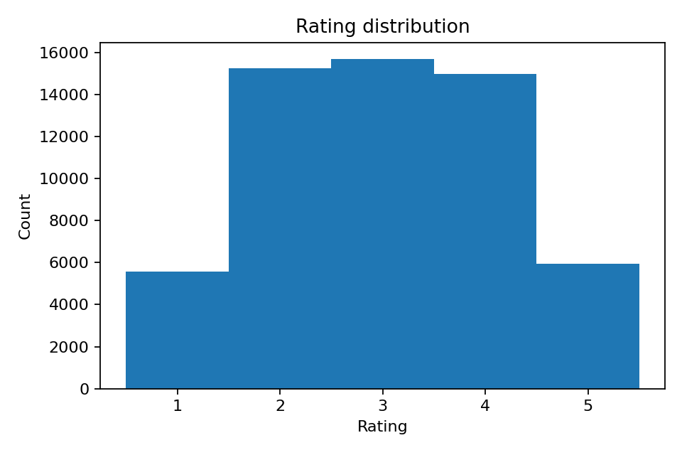
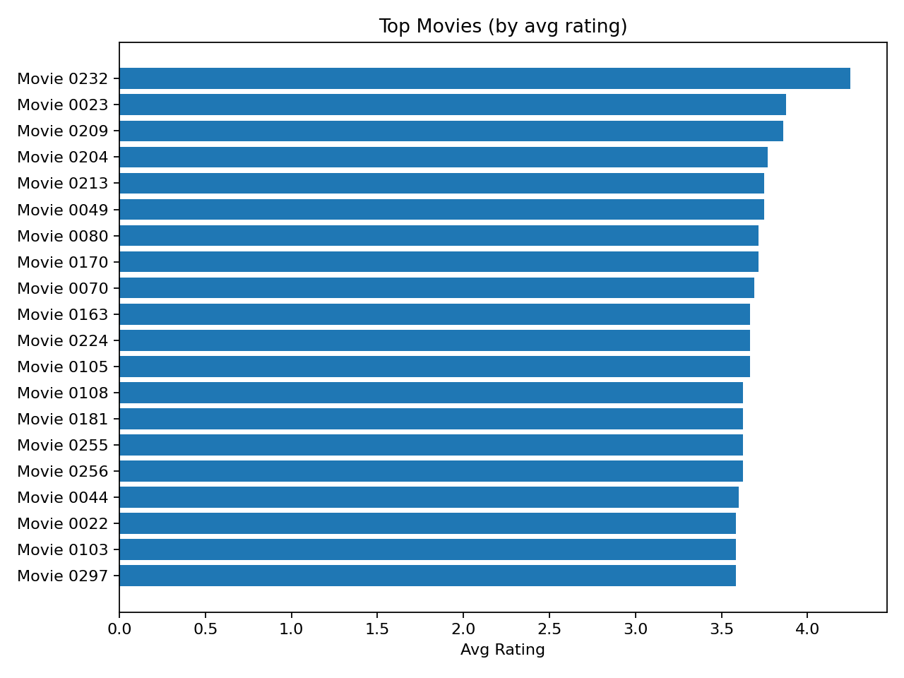
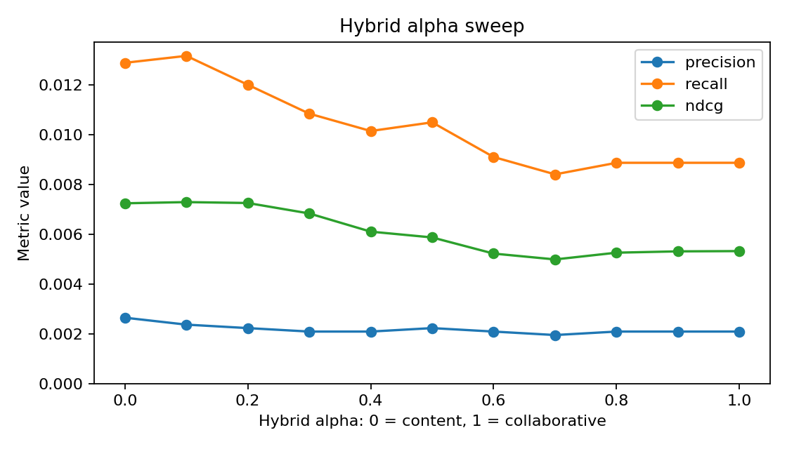

<div align="center">

# Movie Recommendation System


[](https://github.com/AmirhosseinHonardoust/Movie-Recommendation-System/actions/workflows/ci.yml)

</div>

A production-minded movie recommendation workflow for comparing **content-based filtering**, **collaborative filtering**, **hybrid ranking**, **simple baselines**, **alpha-sweep evaluation**, and **structured recommendation outputs** on a synthetic ratings dataset.

> **Important:** This project is a **portfolio and research demo**, not a production recommendation system.
>
> The dataset is synthetic. The recommendation scores, baseline comparisons, and alpha-sweep results are designed to demonstrate recommender-system workflow design. They should not be interpreted as real user-preference performance without evaluation on real interaction data, stronger validation, monitoring, and product review.

---

## Table of Contents

- [Project Overview](#project-overview)
- [What This Project Does](#what-this-project-does)
- [What This Project Does Not Do](#what-this-project-does-not-do)
- [Key Features](#key-features)
- [System Workflow](#system-workflow)
- [Project Structure](#project-structure)
- [Installation](#installation)
- [Quick Start](#quick-start)
- [Synthetic Data Generator](#synthetic-data-generator)
- [Recommendation Methods](#recommendation-methods)
- [Training and Evaluation](#training-and-evaluation)
- [Baselines](#baselines)
- [Hybrid Alpha Sweep](#hybrid-alpha-sweep)
- [Recommendation Outputs](#recommendation-outputs)
- [Evaluation Metrics](#evaluation-metrics)
- [Visual Reports](#visual-reports)
- [Testing and CI](#testing-and-ci)
- [Code Quality](#code-quality)
- [Limitations](#limitations)
- [Responsible Use](#responsible-use)
- [Future Improvements](#future-improvements)
- [Tech Stack](#tech-stack)
- [Author](#author)
- [License](#license)

---

## Project Overview

Recommendation systems are not only about producing a top-10 list. A useful recommender workflow should make it clear:

- what data the model was trained on
- what recommendation strategies are being compared
- whether the model beats simple baselines
- how ranking quality is measured
- how hybrid weights affect performance
- whether already-seen items are excluded
- how sample recommendations can be inspected by a human

This project demonstrates an end-to-end movie recommendation workflow using synthetic movie metadata and rating interactions. It includes synthetic data generation, user-level train/test splitting, content-based recommendations, collaborative recommendations, hybrid recommendations, baseline comparisons, alpha-sweep evaluation, visual reports, structured recommendation exports, automated tests, and GitHub Actions CI.

The goal is to show how a recommender-system demo can be evaluated honestly, not just how to generate recommendations.

---

## What This Project Does

This project can:

- Generate deterministic synthetic movie metadata and user ratings
- Build a user-item ratings matrix
- Split ratings by user for ranking evaluation
- Build a content-based recommender using movie genres
- Build a collaborative recommender using TruncatedSVD
- Blend collaborative and content scores into a hybrid recommender
- Correctly reconstruct SVD scores with `inverse_transform`
- Exclude already-seen movies from recommendations
- Compare models against simple baselines
- Sweep hybrid alpha values from 0.0 to 1.0
- Evaluate Precision@K, Recall@K, and NDCG@K
- Save ranking metrics and comparison artifacts
- Write structured CSV recommendation outputs
- Add short genre-based recommendation reasons
- Generate visual reports for ratings, popular movies, and alpha sweep
- Run automated tests and CI smoke workflows

---

## What This Project Does Not Do

This project does **not**:

- Use real production user behavior
- Prove real-world movie recommendation quality
- Use MovieLens or another external benchmark dataset by default
- Provide real-time recommendation infrastructure
- Include online learning or feedback loops
- Include A/B testing or product analytics
- Model long-term user satisfaction
- Handle full cold-start personalization
- Provide fairness, privacy, or safety certification
- Replace production ranking, monitoring, or experimentation systems

A production recommender would need real user-event data, stronger offline evaluation, online experiments, drift monitoring, retraining workflows, privacy controls, ranking constraints, and product-specific review.

---

## Key Features

- **Synthetic movie and ratings generator** with deterministic seed behavior
- **Content-based filtering** using TF-IDF over movie genres
- **Collaborative filtering** using a sparse user-item matrix and TruncatedSVD
- **Corrected SVD reconstruction** using scikit-learn's `inverse_transform`
- **Hybrid recommender** that blends content and collaborative scores
- **Alpha sweep** to evaluate the hybrid blend from content-only to collaborative-only
- **Baseline comparison** against random, popularity, average-rating, Bayesian-average, and positive-count recommenders
- **Ranking metrics** with Precision@K, Recall@K, and NDCG@K
- **Structured recommendation exports** with rank, movie ID, title, genres, score, and reason
- **Readable text recommendation files** for sample users
- **Visual reports** for rating distribution, top movies, and alpha sweep
- **Unit tests and GitHub Actions CI**
- **Reproducible outputs** for portfolio review

---

## System Workflow

```text
Synthetic movie catalog + user ratings
        ↓
User-level train/test split
        ↓
User-item matrix construction
        ↓
Content-based genre similarity
        ↓
Collaborative SVD reconstruction
        ↓
Hybrid score blending
        ↓
Baseline comparison
        ↓
Precision@K, Recall@K, and NDCG@K evaluation
        ↓
Alpha-sweep analysis
        ↓
Structured recommendation outputs
```

---

## Project Structure

```text
Movie-Recommendation-System/
│
├── .github/
│   └── workflows/
│       └── ci.yml
│
├── data/
│   ├── generate_ratings.py
│   ├── movies.csv
│   └── ratings.csv
│
├── outputs/
│   ├── alpha_sweep.csv
│   ├── alpha_sweep.png
│   ├── baseline_comparison.csv
│   ├── metrics.json
│   ├── ratings_hist.png
│   ├── top_movies.png
│   ├── recs_user_1.csv
│   ├── recs_user_1.txt
│   ├── recs_user_2.csv
│   ├── recs_user_2.txt
│   ├── recs_user_3.csv
│   └── recs_user_3.txt
│
├── src/
│   ├── baselines.py
│   ├── build_recommender.py
│   └── utils.py
│
├── tests/
│   ├── test_alpha_sweep.py
│   ├── test_baselines.py
│   ├── test_collaborative_scoring.py
│   ├── test_data_generation.py
│   ├── test_metrics_and_recommendations.py
│   ├── test_recommendation_outputs.py
│   └── test_split_and_matrix.py
│
├── README.md
├── requirements.txt
└── LICENSE
```

---

## Installation

### 1. Clone the Repository

```bash
git clone https://github.com/AmirhosseinHonardoust/Movie-Recommendation-System.git
cd Movie-Recommendation-System
```

### 2. Create a Virtual Environment

On Windows CMD:

```cmd
python -m venv .venv
.venv\Scripts\activate
```

On macOS/Linux:

```bash
python -m venv .venv
source .venv/bin/activate
```

### 3. Install Requirements

```bash
pip install -r requirements.txt
```

---

## Quick Start

Generate the synthetic movie and ratings dataset:

```bash
python data/generate_ratings.py --users 800 --movies 1200 --seed 42 --outdir data
```

Run the full recommender workflow:

```bash
python src/build_recommender.py --ratings data/ratings.csv --movies data/movies.csv --outdir outputs --k 10 --alpha 0.6 --seed 42
```

Run the tests:

```bash
python -m unittest discover -s tests -v
```

---

## Synthetic Data Generator

The project includes a deterministic synthetic data generator:

```bash
python data/generate_ratings.py \
  --users 800 \
  --movies 1200 \
  --density 0.06 \
  --seed 42 \
  --outdir data
```

Generated files:

```text
data/movies.csv
data/ratings.csv
```

The generator creates:

- movie IDs
- movie titles
- genre metadata
- user IDs
- movie ratings from 1 to 5
- sparse user-item interactions
- latent preference structure
- deterministic output for the same seed

The data is synthetic and intended for recommender-system workflow demonstration, not for real movie-preference benchmarking.

---

## Recommendation Methods

### Content-Based Filtering

The content-based recommender uses movie genres as item metadata. It applies TF-IDF vectorization over genre strings and computes cosine similarity between movies.

This method recommends movies similar to genres the user has interacted with.

### Collaborative Filtering

The collaborative recommender builds a sparse user-item matrix from ratings and applies TruncatedSVD to learn latent user and item structure.

The score reconstruction uses:

```python
scores = svd.inverse_transform(user_factors)
```

This avoids double-scaling the latent representation and keeps scores more interpretable than the earlier manual reconstruction.

### Hybrid Recommendation

The hybrid recommender blends collaborative and content-based scores:

```text
hybrid_score = alpha * collaborative_score + (1 - alpha) * content_score
```

Where:

<div align="center">

| Alpha | Meaning |
|---|---|
| `0.0` | Content-only recommendations |
| `0.5` | Equal content/collaborative blend |
| `1.0` | Collaborative-only recommendations |

</div>

---

## Training and Evaluation

Run the main workflow:

```bash
python src/build_recommender.py \
  --ratings data/ratings.csv \
  --movies data/movies.csv \
  --outdir outputs \
  --k 10 \
  --alpha 0.6 \
  --seed 42
```

Generated evaluation outputs include:

```text
outputs/metrics.json
outputs/baseline_comparison.csv
outputs/alpha_sweep.csv
outputs/alpha_sweep.png
outputs/ratings_hist.png
outputs/top_movies.png
outputs/recs_user_1.csv
outputs/recs_user_1.txt
outputs/recs_user_2.csv
outputs/recs_user_2.txt
outputs/recs_user_3.csv
outputs/recs_user_3.txt
```

---

## Baselines

Recommendation models should be compared against simple baselines. This project evaluates the main recommenders against five baseline strategies.

Baseline comparison is saved in:

```text
outputs/baseline_comparison.csv
```

Baseline strategies include:

<div align="center">

| Baseline | Purpose |
|---|---|
| `random` | Sanity-check lower bound |
| `most_popular` | Recommends the most-rated movies |
| `average_rating` | Recommends movies with the highest mean rating |
| `bayesian_average` | Smooths average rating by item support |
| `positive_count` | Recommends movies with the most positive ratings |

</div>

Example ranking results from the included synthetic run:

<div align="center">

| Model | Precision@10 | Recall@10 | NDCG@10 |
|---|---|---|---|
| `bayesian_average` | 0.0086 | 0.0546 | 0.0283 |
| `content` | 0.0092 | 0.0471 | 0.0272 |
| `hybrid` | 0.0092 | 0.0455 | 0.0227 |
| `average_rating` | 0.0075 | 0.0441 | 0.0221 |
| `collaborative` | 0.0069 | 0.0383 | 0.0196 |
| `most_popular` | 0.0052 | 0.0287 | 0.0186 |
| `positive_count` | 0.0063 | 0.0307 | 0.0146 |
| `random` | 0.0057 | 0.0230 | 0.0137 |

</div>

On the current synthetic dataset, the **Bayesian-average baseline has the strongest NDCG@10**. That is useful information: it shows the synthetic dataset currently rewards simple item-level popularity and rating priors more than the learned collaborative model.

> These values are from a synthetic demo dataset and should not be interpreted as real-world recommendation performance.

---

## Hybrid Alpha Sweep

The workflow evaluates hybrid alpha values from `0.0` to `1.0`:

```text
0.0, 0.1, 0.2, ..., 1.0
```

Alpha-sweep outputs are saved in:

```text
outputs/alpha_sweep.csv
outputs/alpha_sweep.png
```

Example alpha-sweep results from the included run:

<div align="center">

| Alpha | Precision@10 | Recall@10 | NDCG@10 |
|---|---|---|---|
| 0.0 | 0.0092 | 0.0471 | 0.0272 |
| 0.1 | 0.0063 | 0.0302 | 0.0236 |
| 0.2 | 0.0057 | 0.0292 | 0.0211 |
| 0.3 | 0.0080 | 0.0412 | 0.0230 |
| 0.4 | 0.0086 | 0.0412 | 0.0232 |
| 0.5 | 0.0086 | 0.0383 | 0.0225 |
| 0.6 | 0.0092 | 0.0455 | 0.0227 |
| 0.7 | 0.0086 | 0.0436 | 0.0219 |
| 0.8 | 0.0080 | 0.0388 | 0.0208 |
| 0.9 | 0.0080 | 0.0431 | 0.0216 |
| 1.0 | 0.0069 | 0.0383 | 0.0196 |

</div>

The best alpha by NDCG@10 in the included run is:

<div align="center">

| Field | Value |
|---|---|
| Best alpha | 0.0 |
| Interpretation | Content-only blend |
| Best alpha NDCG@10 | 0.0272 |

</div>

This means the current synthetic dataset does not benefit from adding collaborative scores to the content-based ranking. The README reports this honestly instead of claiming the hybrid model is automatically better.

---

## Recommendation Outputs

The workflow writes both readable text files and structured CSV files for sample users.

```text
outputs/recs_user_1.txt
outputs/recs_user_1.csv
outputs/recs_user_2.txt
outputs/recs_user_2.csv
outputs/recs_user_3.txt
outputs/recs_user_3.csv
```

The CSV output includes:

<div align="center">

| Column | Description |
|---|---|
| `rank` | Recommendation rank |
| `user_id` | User receiving the recommendation |
| `movie_id` | Recommended movie ID |
| `title` | Movie title |
| `genres` | Movie genre metadata |
| `score` | Final ranking score |
| `reason` | Short genre-based explanation |

</div>

Example recommendations for one sample user:

<div align="center">

| Rank | Movie | Genres | Score | Reason |
|---|---|---|---|---|
| 1 | Movie 0045 | Crime | 0.6320 | Shares liked genre signals: Crime. |
| 2 | Movie 0049 | Comedy, Sci-Fi | 0.5911 | Shares liked genre signals: Comedy. |
| 3 | Movie 0300 | Romance | 0.5345 | Shares liked genre signals: Romance. |

</div>

The explanation strings are simple genre-overlap summaries. They are not causal explanations, but they make the recommendation output easier to inspect.

---

## Evaluation Metrics

The evaluation layer uses ranking metrics designed for top-K recommendation tasks.

<div align="center">

| Metric | Why it matters |
|---|---|
| Precision@K | Measures how many recommended movies are relevant |
| Recall@K | Measures how many relevant held-out movies are recovered |
| NDCG@K | Rewards relevant movies appearing higher in the ranking |

</div>

For this project, a relevant held-out movie is a test-set movie with rating greater than or equal to 4.

The main metrics are saved in:

```text
outputs/metrics.json
```

Important interpretation:

- Low metric values are expected on sparse synthetic data.
- Baselines are included so the learned recommenders can be judged honestly.
- NDCG@10 is the main comparison metric in the included outputs.
- Strong performance on this synthetic data does not imply real-world movie recommendation quality.

---

## Visual Reports

### Dataset and item-level reports

<div align="center">

| Rating Distribution | Top Movies |
|---|---|
|  |  |
| **Analysis:** The rating distribution helps check whether the synthetic generator creates a usable spread of 1-5 ratings. | **Analysis:** The top-movies chart shows which items receive the highest average ratings in the generated data. |

</div>

### Hybrid alpha behavior

<div align="center">

| Alpha Sweep |
|---|
|  |
| **Analysis:** The alpha sweep compares content-only, collaborative-only, and blended recommendation scores. In the included run, content-only ranking performs best among the tested alpha values. |

</div>

---

## Testing and CI

Run unit tests locally:

```bash
python -m unittest discover -s tests -v
```

Compile source files:

```bash
python -m compileall data src tests
```

The GitHub Actions workflow checks:

- dependency installation
- source compilation
- unit tests
- synthetic data generation
- recommender workflow execution
- metrics JSON validation
- baseline comparison validation
- alpha-sweep validation
- recommendation CSV schema validation
- generated output artifacts

CI is defined in:

```text
.github/workflows/ci.yml
```

---

## Code Quality

The project separates core responsibilities across focused modules.

<div align="center">

| Module | Purpose |
|---|---|
| `data/generate_ratings.py` | Generates deterministic synthetic movie and ratings data |
| `src/utils.py` | Handles user-level train/test split and user-item matrix construction |
| `src/baselines.py` | Builds simple recommender baseline score vectors |
| `src/build_recommender.py` | Runs modeling, evaluation, alpha sweep, plots, and sample outputs |
| `tests/` | Validates data generation, metrics, recommendations, baselines, alpha sweep, and SVD scoring |

</div>

The current design is intentionally compact for a portfolio project. A larger production system would likely split the modeling, evaluation, plotting, and output-writing logic into additional modules.

---

## Limitations

This project has important limitations:

- The dataset is synthetic, not real user interaction data
- The project is not benchmarked against MovieLens by default
- The genre metadata is simple and limited
- The collaborative model is intentionally lightweight
- The hybrid model does not beat the best simple baseline on the included synthetic run
- Recommendation reasons are heuristic genre summaries
- No implicit-feedback ranking model is included
- No online evaluation or A/B testing is included
- No real-time serving API is included
- No privacy, fairness, or product-safety review is included

The project is strongest as a portfolio demonstration of recommender-system workflow design, baseline comparison, and ranking evaluation.

---

## Responsible Use

This repository is intended for:

- learning recommender-system workflows
- demonstrating content-based and collaborative filtering
- practicing ranking metric evaluation
- comparing models with simple baselines
- showing reproducible ML project structure
- portfolio demonstration

It should not be used as-is for:

- production personalization
- real user targeting
- real ranking decisions
- commercial recommender deployment
- user profiling
- high-stakes content recommendation

Any real deployment would require real interaction data, privacy review, online experimentation, monitoring, ranking constraints, feedback-loop analysis, and product governance.

---

## Future Improvements

Potential next improvements:

- Add optional MovieLens dataset support
- Add time-based train/test splitting
- Add implicit-feedback models such as ALS or BPR
- Add item metadata beyond genres
- Add user-profile summaries
- Add MAP@K and MRR@K
- Add confidence intervals for ranking metrics
- Add cold-start user and cold-start item evaluation
- Add model cards for recommender limitations
- Add FastAPI recommendation endpoint
- Add Streamlit demo for interactive user recommendations
- Add Docker support
- Refactor the main workflow into smaller modeling and reporting modules

---

## Tech Stack

- Python
- pandas
- NumPy
- SciPy
- scikit-learn
- matplotlib
- unittest
- GitHub Actions

---

## Author

**Amir Honardoust**

GitHub: [@AmirhosseinHonardoust](https://github.com/AmirhosseinHonardoust)

---

## License

This project is intended for educational and portfolio purposes.

If you use or modify this project, please keep the responsible-use notes and limitations clear.
