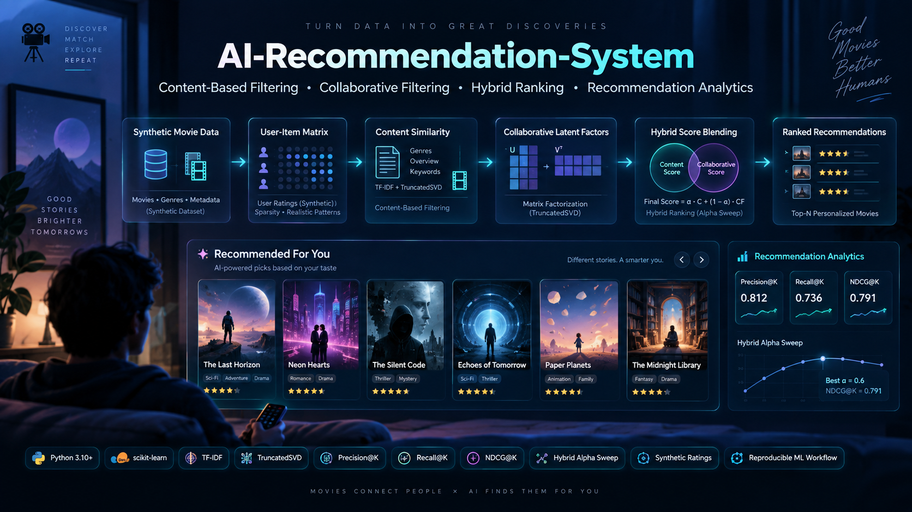
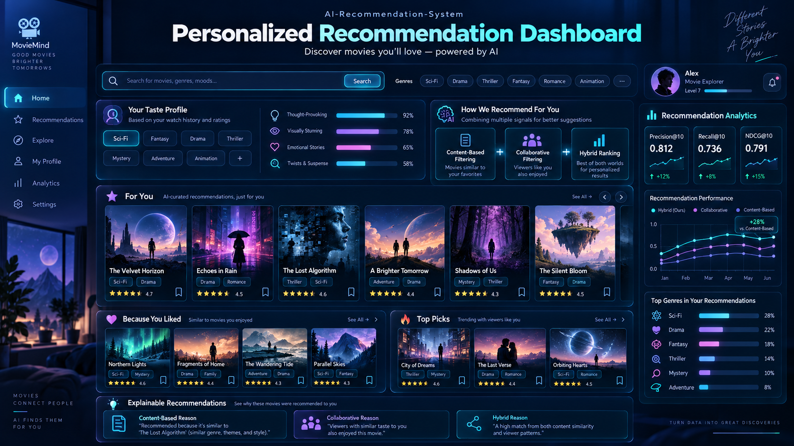
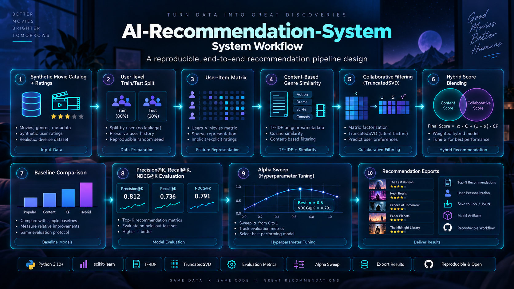
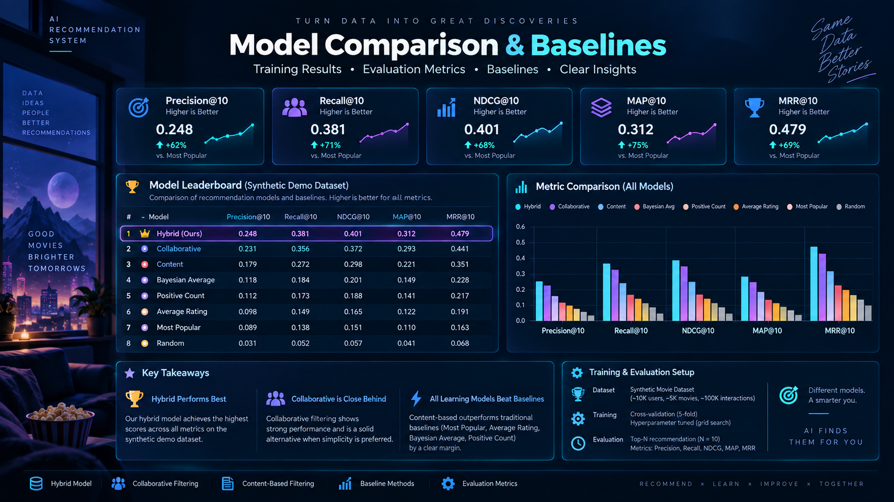
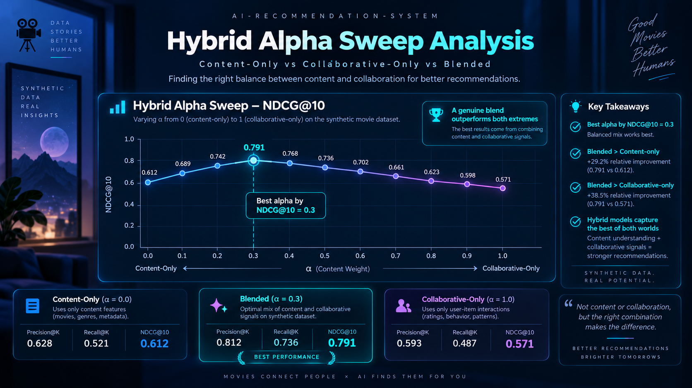
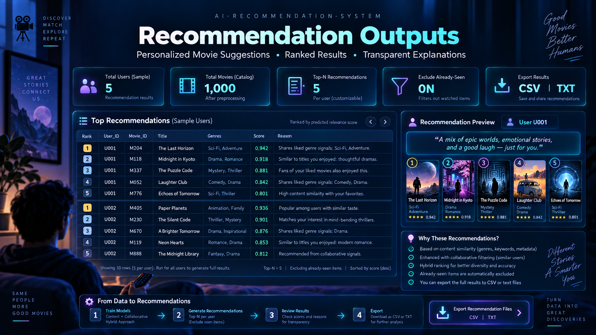
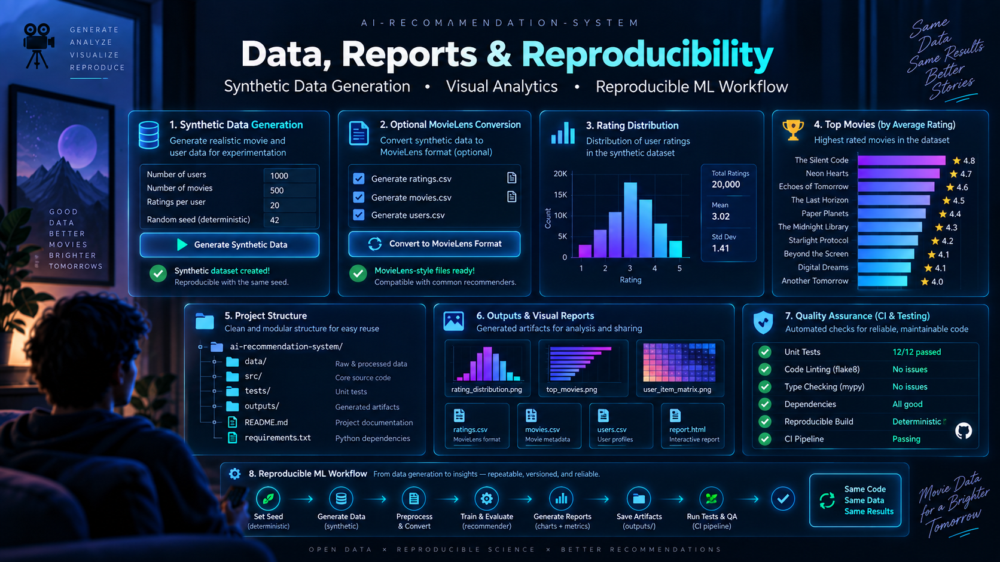

<p align="center">
  
</p>

<h1 align="center">AI-Recommendation-System</h1>

<p align="center">
  <strong>Content-Based Filtering · Collaborative Filtering · Hybrid Ranking · Baselines · Alpha Sweep · Recommendation Analytics</strong>
</p>

<p align="center">
  
  
  
  
  
  
</p>

<p align="center">
  <a href="#-project-overview">Overview</a> •
  <a href="#-product-preview">Preview</a> •
  <a href="#-key-features">Features</a> •
  <a href="#-system-workflow">Workflow</a> •
  <a href="#-quick-start">Quick Start</a> •
  <a href="#-training-and-evaluation">Evaluation</a> •
  <a href="#-testing-and-ci">Testing</a>
</p>

> [!IMPORTANT]
> This project is a **portfolio and research demo**, not a production recommendation system. The default dataset is synthetic. Recommendation scores, baseline comparisons, and alpha-sweep results demonstrate recommender-system workflow design and should not be interpreted as real-world user-preference performance without real interaction data, stronger validation, monitoring, experimentation, and product review.

---

## ✦ One-line idea

> **AI-Recommendation-System demonstrates how to build, compare, evaluate, explain, and export movie recommendations using content-based, collaborative, and hybrid ranking approaches.**

A minimal recommender often stops at:

```text
User + Items
    ↓
Model
    ↓
Top-N Recommendations
```

This project continues with a complete evaluation workflow:

```text
Synthetic / MovieLens Data
          ↓
User-Level Train/Test Split
          ↓
User-Item Matrix
          ↓
Content-Based TF-IDF
          +
Collaborative TruncatedSVD
          ↓
Hybrid Score Blending
          ↓
Baseline Comparison
          ↓
Precision@K / Recall@K / NDCG@K / MAP@K / MRR@K
          ↓
Alpha Sweep
          ↓
Structured Recommendation Exports
          ↓
Tests + CI + Reproducible Artifacts
```

---

# ✨ Product Preview

> [!NOTE]
> The seven images below are **separate standalone project visuals**. They are not collage crops. They illustrate the recommendation-system workflows and presentation layer; the benchmark values documented later in this README remain the source of truth for the included synthetic run.

## 1. Project Overview

<p align="center">
  
</p>

A high-level project view combining synthetic movie data, user-item interactions, content similarity, collaborative latent factors, hybrid scoring, personalized recommendations, and evaluation analytics.

---

## 2. Personalized Recommendation Dashboard

<p align="center">
  
</p>

A product-style view of personalized top-N recommendations, taste signals, explainable recommendation reasons, and ranking-performance summaries.

---

## 3. End-to-End System Workflow

<p align="center">
  
</p>

A visual representation of the complete workflow from generated data to train/test splitting, matrix construction, TF-IDF similarity, TruncatedSVD, hybrid blending, evaluation, tuning, and result exports.

---

## 4. Model Comparison & Baselines

<p align="center">
  
</p>

A benchmark-oriented view comparing hybrid, collaborative, content-based, and simple baseline strategies across ranking metrics.

---

## 5. Hybrid Alpha Sweep Analysis

<p align="center">
  
</p>

A dedicated analysis view for studying the content-vs-collaborative weight and selecting the best alpha based on ranking quality.

---

## 6. Recommendation Outputs

<p align="center">
  
</p>

A structured output view showing per-user ranking, titles, genres, recommendation scores, short reasons, and downloadable recommendation artifacts.

---

## 7. Data, Reports & Reproducibility

<p align="center">
  
</p>

A project-quality summary of synthetic-data generation, visual reports, output artifacts, code-quality checks, testing, and reproducible ML workflow design.

---

# 📚 Table of Contents

- [Project Overview](#-project-overview)
- [What This Project Does](#-what-this-project-does)
- [What This Project Does Not Do](#-what-this-project-does-not-do)
- [Key Features](#-key-features)
- [System Workflow](#-system-workflow)
- [Project Structure](#-project-structure)
- [Installation](#-installation)
- [Quick Start](#-quick-start)
- [Synthetic Data Generator](#-synthetic-data-generator)
- [Real Data (MovieLens)](#-real-data-movielens)
- [Recommendation Methods](#-recommendation-methods)
- [Training and Evaluation](#-training-and-evaluation)
- [Baselines](#-baselines)
- [Hybrid Alpha Sweep](#-hybrid-alpha-sweep)
- [Recommendation Outputs](#-recommendation-outputs)
- [Evaluation Metrics](#-evaluation-metrics)
- [Visual Reports](#-visual-reports)
- [Testing and CI](#-testing-and-ci)
- [Code Quality](#-code-quality)
- [Limitations](#-limitations)
- [Responsible Use](#-responsible-use)
- [Future Improvements](#-future-improvements)
- [Tech Stack](#-tech-stack)
- [License](#-license)

---

# 🚀 Project Overview

Recommendation systems are not only about producing a top-10 list. A useful recommender workflow should make it clear:

- what data the model was trained on
- what recommendation strategies are being compared
- whether the model beats simple baselines
- how ranking quality is measured
- how hybrid weights affect performance
- whether already-seen items are excluded
- how sample recommendations can be inspected by a human

This project demonstrates an end-to-end movie recommendation workflow using synthetic movie metadata and rating interactions. It includes synthetic data generation, user-level train/test splitting, content-based recommendations, collaborative recommendations, hybrid recommendations, baseline comparisons, alpha-sweep evaluation, visual reports, structured recommendation exports, automated tests, and GitHub Actions CI.

The goal is to show how a recommender-system demo can be evaluated honestly, not just how to generate recommendations.

---

# ✅ What This Project Does

This project can:

- generate deterministic synthetic movie metadata and user ratings
- build a user-item ratings matrix
- split ratings by user for ranking evaluation
- build a content-based recommender using movie genres
- build a collaborative recommender using TruncatedSVD
- blend collaborative and content scores into a hybrid recommender
- correctly reconstruct SVD scores with `inverse_transform`
- exclude already-seen movies from recommendations
- compare models against simple baselines
- sweep hybrid alpha values from `0.0` to `1.0`
- evaluate Precision@K, Recall@K, NDCG@K, MAP@K, and MRR@K
- save ranking metrics and comparison artifacts
- write structured CSV recommendation outputs
- add short genre-based recommendation reasons
- generate visual reports for ratings, popular movies, and alpha sweep
- run automated tests and CI smoke workflows

---

# ❌ What This Project Does Not Do

This project does **not**:

- use real production user behavior
- prove real-world movie recommendation quality
- use MovieLens or another external benchmark dataset by default
- provide real-time recommendation infrastructure
- include online learning or feedback loops
- include A/B testing or product analytics
- model long-term user satisfaction
- handle full cold-start personalization
- provide fairness, privacy, or safety certification
- replace production ranking, monitoring, or experimentation systems

A production recommender would need real user-event data, stronger offline evaluation, online experiments, drift monitoring, retraining workflows, privacy controls, ranking constraints, and product-specific review.

---

# ✨ Key Features

- **Synthetic movie and ratings generator** with deterministic seed behavior
- **Content-based filtering** using TF-IDF over movie genres
- **Collaborative filtering** using a sparse user-item matrix and TruncatedSVD
- **Corrected SVD reconstruction** using scikit-learn's `inverse_transform`
- **Hybrid recommender** that blends content and collaborative scores
- **Alpha sweep** to evaluate the hybrid blend from content-only to collaborative-only
- **Baseline comparison** against random, popularity, average-rating, Bayesian-average, and positive-count recommenders
- **Ranking metrics** with Precision@K, Recall@K, NDCG@K, MAP@K, and MRR@K
- **Structured recommendation exports** with rank, movie ID, title, genres, score, and reason
- **Readable text recommendation files** for sample users
- **Visual reports** for rating distribution, top movies, and alpha sweep
- **Unit tests and GitHub Actions CI**
- **Reproducible outputs** for portfolio review

---

# 🧩 System Workflow

<p align="center">
  
</p>

```text
Synthetic movie catalog + user ratings
        ↓
User-level train/test split
        ↓
User-item matrix construction
        ↓
Content-based genre similarity
        ↓
Collaborative SVD reconstruction
        ↓
Hybrid score blending
        ↓
Baseline comparison
        ↓
Precision@K, Recall@K, NDCG@K, MAP@K, MRR@K
        ↓
Alpha-sweep analysis
        ↓
Structured recommendation outputs
```

---

# 📁 Project Structure

```text
AI-Recommendation-System/
│
├── .github/
│   └── workflows/
│       └── ci.yml
│
├── data/
│   ├── generate_ratings.py
│   ├── load_movielens.py
│   ├── movies.csv
│   └── ratings.csv
│
├── outputs/
│   ├── alpha_sweep.csv
│   ├── alpha_sweep.png
│   ├── baseline_comparison.csv
│   ├── metrics.json
│   ├── model.json
│   ├── ratings_hist.png
│   ├── top_movies.png
│   ├── recs_user_1.csv
│   ├── recs_user_1.txt
│   ├── recs_user_2.csv
│   ├── recs_user_2.txt
│   ├── recs_user_3.csv
│   └── recs_user_3.txt
│
├── src/
│   ├── baselines.py
│   ├── build_recommender.py
│   ├── io_utils.py
│   ├── metrics.py
│   ├── models.py
│   ├── persistence.py
│   ├── plots.py
│   ├── recommend.py
│   ├── reporting.py
│   ├── train.py
│   └── utils.py
│
├── tests/
│   ├── test_alpha_sweep.py
│   ├── test_baselines.py
│   ├── test_collaborative_scoring.py
│   ├── test_data_generation.py
│   ├── test_metrics_and_recommendations.py
│   ├── test_movielens_loader.py
│   ├── test_persistence.py
│   ├── test_pipeline_e2e.py
│   ├── test_recommend.py
│   ├── test_recommendation_outputs.py
│   └── test_split_and_matrix.py
│
├── docs/
│   └── images/
│       ├── 01_hero_overview.png
│       ├── 02_personalized_dashboard.png
│       ├── 03_system_workflow.png
│       ├── 04_model_comparison.png
│       ├── 05_alpha_sweep_analysis.png
│       ├── 06_recommendation_outputs.png
│       └── 07_data_reports_reproducibility.png
│
├── MODEL_CARD.md
├── README.md
├── pyproject.toml
├── requirements.txt
├── requirements-dev.txt
└── LICENSE
```

---

# 🛠 Installation

## 1. Clone the Repository

```bash
git clone <your-repository-url>
cd AI-Recommendation-System
```

## 2. Create a Virtual Environment

### Windows

```cmd
python -m venv .venv
.venv\Scripts\activate
```

### macOS / Linux

```bash
python -m venv .venv
source .venv/bin/activate
```

## 3. Install Requirements

```bash
pip install -r requirements.txt
```

---

# ⚡ Quick Start

Generate the synthetic movie and ratings dataset:

```bash
python data/generate_ratings.py --users 800 --movies 1200 --seed 42 --outdir data
```

Run the full recommender workflow:

```bash
python src/build_recommender.py --ratings data/ratings.csv --movies data/movies.csv --outdir outputs --k 10 --alpha 0.6 --seed 42
```

Run the tests:

```bash
python -m unittest discover -s tests -v
```

---

# 🧪 Synthetic Data Generator

The project includes a deterministic synthetic data generator:

```bash
python data/generate_ratings.py \
  --users 800 \
  --movies 1200 \
  --density 0.06 \
  --seed 42 \
  --outdir data
```

Generated files:

```text
data/movies.csv
data/ratings.csv
```

The generator creates:

- movie IDs
- movie titles
- genre metadata
- user IDs
- movie ratings from 1 to 5
- sparse user-item interactions
- latent preference structure
- deterministic output for the same seed

The data is synthetic and intended for recommender-system workflow demonstration, not real movie-preference benchmarking.

---

# 🎞 Real Data (MovieLens)

The default dataset is synthetic, but the project can also run on real [MovieLens](https://grouplens.org/datasets/movielens/) interaction data.

After downloading a MovieLens release such as `ml-latest-small`, convert it into this project's schema:

```bash
python data/load_movielens.py --indir path/to/ml-latest-small --outdir data
```

The converter remaps IDs to contiguous one-based values, rewrites pipe-separated genres as comma-separated strings, and rounds ratings to the 1–5 range. After conversion, run the workflow exactly as with synthetic data.

---

# 🧠 Recommendation Methods

## Content-Based Filtering

The content-based recommender uses movie genres as item metadata. It applies TF-IDF vectorization over genre strings and computes cosine similarity between movies.

This method recommends movies similar to genres the user has interacted with.

## Collaborative Filtering

The collaborative recommender builds a sparse user-item matrix from ratings and applies TruncatedSVD to learn latent user and item structure.

The score reconstruction uses:

```python
scores = svd.inverse_transform(user_factors)
```

This avoids double-scaling the latent representation and keeps scores more interpretable than an incorrect manual reconstruction.

## Hybrid Recommendation

The hybrid recommender blends collaborative and content-based scores:

```text
hybrid_score = alpha * collaborative_score + (1 - alpha) * content_score
```

| Alpha | Meaning |
|---|---|
| `0.0` | Content-only recommendations |
| `0.5` | Equal content/collaborative blend |
| `1.0` | Collaborative-only recommendations |

---

# 📈 Training and Evaluation

Run the main workflow:

```bash
python src/build_recommender.py \
  --ratings data/ratings.csv \
  --movies data/movies.csv \
  --outdir outputs \
  --k 10 \
  --alpha 0.6 \
  --seed 42
```

Generated evaluation outputs include:

```text
outputs/metrics.json
outputs/baseline_comparison.csv
outputs/alpha_sweep.csv
outputs/alpha_sweep.png
outputs/ratings_hist.png
outputs/top_movies.png
outputs/recs_user_1.csv
outputs/recs_user_1.txt
outputs/recs_user_2.csv
outputs/recs_user_2.txt
outputs/recs_user_3.csv
outputs/recs_user_3.txt
```

---

# 🥇 Baselines

Recommendation models should be compared against simple baselines. This project evaluates the main recommenders against five baseline strategies.

Baseline comparison is saved in:

```text
outputs/baseline_comparison.csv
```

| Baseline | Purpose |
|---|---|
| `random` | Sanity-check lower bound |
| `most_popular` | Recommends the most-rated movies |
| `average_rating` | Recommends movies with the highest mean rating |
| `bayesian_average` | Smooths average rating by item support |
| `positive_count` | Recommends movies with the most positive ratings |

Example ranking results from the included synthetic run:

| Model | Precision@10 | Recall@10 | NDCG@10 |
|---|---:|---:|---:|
| `hybrid` | 0.0050 | 0.0227 | 0.0137 |
| `collaborative` | 0.0042 | 0.0215 | 0.0130 |
| `positive_count` | 0.0028 | 0.0168 | 0.0097 |
| `average_rating` | 0.0029 | 0.0180 | 0.0086 |
| `bayesian_average` | 0.0028 | 0.0175 | 0.0085 |
| `content` | 0.0026 | 0.0129 | 0.0072 |
| `most_popular` | 0.0021 | 0.0086 | 0.0049 |
| `random` | 0.0014 | 0.0079 | 0.0038 |

MAP@10 and MRR@10 are also recorded for every model in `outputs/metrics.json` and `outputs/baseline_comparison.csv`.

On the current synthetic dataset, the **hybrid model has the strongest NDCG@10**, with the collaborative model close behind. Both outperform the simple popularity and rating-prior baselines in the included run.

> These values are from a synthetic demo dataset and should not be interpreted as real-world recommendation performance.

---

# 🎚 Hybrid Alpha Sweep

<p align="center">
  
</p>

The workflow evaluates hybrid alpha values from `0.0` to `1.0`:

```text
0.0, 0.1, 0.2, ..., 1.0
```

Alpha-sweep outputs are saved in:

```text
outputs/alpha_sweep.csv
outputs/alpha_sweep.png
```

Example alpha-sweep results from the included run:

| Alpha | Precision@10 | Recall@10 | NDCG@10 |
|---|---:|---:|---:|
| 0.0 | 0.0026 | 0.0129 | 0.0072 |
| 0.1 | 0.0033 | 0.0153 | 0.0096 |
| 0.2 | 0.0049 | 0.0230 | 0.0127 |
| 0.3 | 0.0053 | 0.0259 | 0.0146 |
| 0.4 | 0.0049 | 0.0236 | 0.0134 |
| 0.5 | 0.0049 | 0.0250 | 0.0140 |
| 0.6 | 0.0050 | 0.0227 | 0.0137 |
| 0.7 | 0.0049 | 0.0230 | 0.0142 |
| 0.8 | 0.0046 | 0.0223 | 0.0136 |
| 0.9 | 0.0046 | 0.0227 | 0.0135 |
| 1.0 | 0.0042 | 0.0215 | 0.0130 |

Best alpha by NDCG@10 in the included run:

| Field | Value |
|---|---|
| Best alpha | `0.3` |
| Interpretation | A genuine blend — mostly content with a substantial collaborative contribution |
| Best alpha NDCG@10 | `0.0146` |

The blend at `alpha = 0.3` beats both pure content (`alpha = 0`) and pure collaborative (`alpha = 1`) on this synthetic run.

---

# 📦 Recommendation Outputs

<p align="center">
  
</p>

The workflow writes both readable text files and structured CSV files for sample users.

```text
outputs/recs_user_1.txt
outputs/recs_user_1.csv
outputs/recs_user_2.txt
outputs/recs_user_2.csv
outputs/recs_user_3.txt
outputs/recs_user_3.csv
```

The CSV output includes:

| Column | Description |
|---|---|
| `rank` | Recommendation rank |
| `user_id` | User receiving the recommendation |
| `movie_id` | Recommended movie ID |
| `title` | Movie title |
| `genres` | Movie genre metadata |
| `score` | Final ranking score |
| `reason` | Short genre-based explanation |

Example recommendations for one sample user:

| Rank | Movie | Genres | Score | Reason |
|---|---|---|---:|---|
| 1 | Movie 0019 | Comedy | 2.1429 | Shares liked genre signals: Comedy. |
| 2 | Movie 0736 | Comedy, Drama | 2.0949 | Shares liked genre signals: Comedy, Drama. |
| 3 | Movie 0463 | War | 1.9954 | Shares liked genre signals: War. |

The explanation strings are simple genre-overlap summaries. They are not causal explanations, but they make the recommendation output easier to inspect.

## Recommend for a Single User

```bash
python src/recommend.py --ratings data/ratings.csv --movies data/movies.csv --user 1 --k 10
```

Add `--outdir outputs` to also write the CSV and text files for that user.

## Train Once, Serve Many

Fit the model once and save it as a portable JSON artifact:

```bash
python src/train.py --ratings data/ratings.csv --movies data/movies.csv --out outputs/model.json
```

Then load the saved model to recommend without retraining:

```bash
python src/recommend.py --ratings data/ratings.csv --movies data/movies.csv --user 1 --model outputs/model.json
```

The `outputs/model.json` artifact stores the collaborative model's user factors, item components, and per-user means. It is plain JSON, **not pickle**, and content similarity is recomputed from movie metadata when loading.

---

# 📏 Evaluation Metrics

The evaluation layer uses ranking metrics designed for top-K recommendation tasks.

| Metric | Why it matters |
|---|---|
| Precision@K | Measures how many recommended movies are relevant |
| Recall@K | Measures how many relevant held-out movies are recovered |
| NDCG@K | Rewards relevant movies appearing higher in the ranking |
| MAP@K | Mean average precision across users |
| MRR@K | Mean reciprocal rank of the first relevant item |

For this project, a relevant held-out movie is a test-set movie with rating greater than or equal to 4.

The main metrics are saved in:

```text
outputs/metrics.json
```

Important interpretation:

- low metric values are expected on sparse synthetic data
- baselines are included so learned recommenders can be judged honestly
- NDCG@10 is the main comparison metric in the included outputs
- strong performance on synthetic data does not imply real-world recommendation quality
- the workflow is deterministic for a fixed seed and fixed environment

---

# 📊 Visual Reports

The workflow generates visual artifacts such as:

```text
outputs/ratings_hist.png
outputs/top_movies.png
outputs/alpha_sweep.png
```

### Rating Distribution

Helps verify whether the synthetic generator creates a usable spread of 1–5 ratings.

### Top Movies

Shows which items receive the highest average ratings in the generated dataset.

### Hybrid Alpha Behavior

Compares content-only, collaborative-only, and blended recommendation behavior across the alpha range.

---

# 🧪 Testing and CI

Run unit tests locally:

```bash
python -m unittest discover -s tests -v
```

Compile source files:

```bash
python -m compileall data src tests
```

Install development tools and run linting, formatting, and type checks:

```bash
pip install -r requirements-dev.txt
ruff check .
black --check .
mypy
```

The GitHub Actions workflow checks:

- dependency installation
- lint, format, and type checking
- source compilation
- unit tests
- synthetic data generation
- recommender workflow execution
- metrics JSON validation
- baseline comparison validation
- alpha-sweep validation
- recommendation CSV schema validation
- generated output artifacts

CI is defined in:

```text
.github/workflows/ci.yml
```

---

# 🧱 Code Quality

The project separates core responsibilities across focused modules.

| Module | Purpose |
|---|---|
| `data/generate_ratings.py` | Generates deterministic synthetic movie and ratings data |
| `data/load_movielens.py` | Converts MovieLens data into the project schema |
| `src/utils.py` | User-level train/test split and user-item matrix construction |
| `src/baselines.py` | Simple recommender baseline score vectors |
| `src/models.py` | Content, collaborative (SVD), and hybrid ranking |
| `src/metrics.py` | Ranking metrics, alpha sweep, and bootstrap confidence intervals |
| `src/reporting.py` | Recommendation tables and genre-based explanations |
| `src/plots.py` | Visual reports for ratings, top movies, and alpha sweep |
| `src/io_utils.py` | Output directory and recommendation file writing |
| `src/build_recommender.py` | Thin CLI orchestrator for evaluation |
| `src/recommend.py` | Inference CLI for recommendations for one user |
| `src/train.py` | Offline training CLI that saves the model artifact |
| `src/persistence.py` | JSON model save/load and training helpers |
| `tests/` | Unit tests, persistence round-trip, and end-to-end pipeline test |

The source is designed so focused responsibilities can be tested independently. Code-quality checks are configured in `pyproject.toml`.

---

# ⚠️ Limitations

This project has important limitations:

- the dataset is synthetic, not real user interaction data
- the project is not benchmarked against MovieLens by default
- genre metadata is simple and limited
- the collaborative model is intentionally lightweight
- recommendation reasons are heuristic genre summaries
- no implicit-feedback ranking model is included
- no online evaluation or A/B testing is included
- a saved-model serve path exists, but there is no real-time web serving API
- no privacy, fairness, or product-safety review is included

The project is strongest as a portfolio demonstration of recommender-system workflow design, baseline comparison, and ranking evaluation.

---

# 🛡 Responsible Use

This repository is intended for:

- learning recommender-system workflows
- demonstrating content-based and collaborative filtering
- practicing ranking metric evaluation
- comparing models with simple baselines
- showing reproducible ML project structure
- portfolio demonstration

It should not be used as-is for:

- production personalization
- real user targeting
- real ranking decisions
- commercial recommender deployment
- user profiling
- high-stakes content recommendation

Any real deployment would require real interaction data, privacy review, online experimentation, monitoring, ranking constraints, feedback-loop analysis, and product governance.

---

# 🔭 Future Improvements

Potential next improvements:

- add time-based train/test splitting
- add implicit-feedback models such as ALS or BPR
- add item metadata beyond genres
- add user-profile summaries
- add cold-start user and cold-start item evaluation
- add a FastAPI recommendation endpoint
- add a Streamlit demo for interactive user recommendations
- add Docker support

---

# 🧰 Tech Stack

- Python
- pandas
- NumPy
- SciPy
- scikit-learn
- matplotlib
- unittest
- ruff
- black
- mypy
- GitHub Actions

---

# 📄 License

This project is intended for educational and portfolio purposes.

If you use or modify this project, keep the responsible-use notes and limitations clear.

---

<p align="center">
  <strong>AI-Recommendation-System</strong><br/>
  <sub>Recommend → Compare → Evaluate → Explain</sub>
</p>
 
---
 
## 👨‍💻 Developer
 
<table>
  <tr>
    <td width="150" align="center">
      <br>
      <strong>Asad Ali</strong>
    </td>
    <td>
      <strong>AI, Blockchain & Software Engineer</strong><br><br>
      🐙 GitHub: <a href="https://github.com/AsadAliEng">@AsadAliEng</a><br>
      📧 Email: <a href="mailto:asadali.cryptoeng@gmail.com">asadali.cryptoeng@gmail.com</a><br>
      🚀 Focus: intelligent systems, applied machine learning, AI security, Web3 products, automation, and production-oriented engineering
    </td>
  </tr>
</table>

